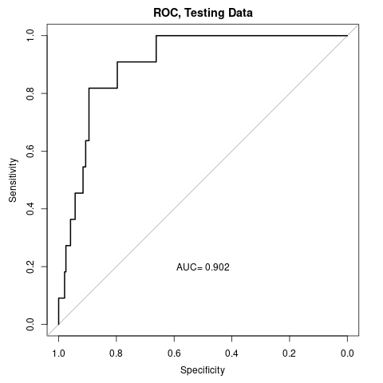

Introduction
==============
Professional sport organizations seek to identify and sign talented athletes to their team early in the player's career. This approach both maximizes the amount of time said player spends on their team during their primes while ideally minimizing initial investment costs. However, prediction of a given player's future performance can be a notoriously difficult task for many reasons, such as the quality of the player's team/associated infrastructure (ex. coaching staff quality) and overall trajectory of a player's career.

While induction to the Hall of Fame (HOF) is an honor reserved for relatively few players, HOF status may serve as a benchmark for assessment, in the sense that those who are predicted to have a higher likelihood of HOF status may be a player of value beyond those offered by traditional metrics. Obviously there are other considerations we would need to consider to assess a player's worth to a given team and/or performance overall, but this could serve as a good starting place.

To examine the predictive ability of rookie year statistics on NBA performance, I used the "NBA Rookies Performance Statistics and Minutes" dataset available on Kaggle (https://www.kaggle.com/datasets/thedevastator/nba-rookies-performance-statistics-and-minutes-p). This dataset includes players drafted from 1980-2016. I additionally noted which players were added to the HOF since 2016 in the provided dataset (these players were all drafted well before 2016).

Initial Data Exploration: Boxplots
===============
There were a total of 45 Hall-of-Fame players in this dataset out of a total of around 1500 players altogether for the final analysis. I first generated a few boxplots to compare overall averages of metrics of HOF versus non-HOF players. A few notable trends stood out that might be worth future exploration:

1. Distribution of exposure-related variables (ex. rookie games played, rookie minutes played per game) were clearly higher among HOF players compared to their counterparts.
```{r, echo=FALSE, fig.cap="Comparative Distribution of Game Exposure Variables by Hall-of-Fame Status", out.width='60%', fig.show='hold'}
library(tinytex)

```

\newpage

2. Averages of standard rookie box-score counts (points, rebound, assists, steals, and blocks) per game among HOF players were almost consistently 2-3 times that among non-HOF players. 
```{r, echo=FALSE, fig.cap="Comparative Distribution of Standard Box-Score Counts per Game by Hall-of-Fame Status", out.width='80%', fig.show='hold'}


```

3. Interestingly, 3-point shots made and percentage were the only metrics that were lower among NBA HOFs compared to their counterparts. I suspect this finding may be due to a shift in NBA gameplay strategies towards high-efficiency shooting that favors 3-point shots in the modern NBA era.
```{r, echo=FALSE, fig.cap="Comparative Distribution of 3-Point Shots per Game by Hall-of-Fame Status", out.width='50%', fig.show='hold'}

```

4. As expected, rookie efficiency (the only advanced/holistic metric on the list) appeared to be higher among HOF players compared to their non-HOF counterparts.
```{r, echo=FALSE, fig.cap="Comparative Distribution of Efficiency per Game by Hall-of-Fame Status", out.width='80%', fig.show='hold'}

```

\newpage

PCA Analysis
====================
Next, I conducted a PCA analysis for dimensionality reduction. I decided to first look at traditional count statistics (points, assists, rebounds, blocks, and steals per game) to evaluate if there might be any trends. I thought this would be a simpler way of evaluating for patterns prior to using advanced metrics such as efficiency, which employs each of these variables in its calculation. 

Below are the scree plots, biplot, and biplots labeled by HOF status for this analysis, which shows that 1) the first two PCs describe much of the variance in the dataset and 2) while no strong clustering effect is observed, HOF players tend to show up at lower values of PC1 that might be exploitable (or more become prominent when incorporating advanced metrics, which I decided to do next).
```{r, echo=FALSE, fig.cap="Scree Plot and Biplots by HOF Status", out.width='40%', fig.show='hold'}

knitr::include_graphics("figures/HOFbiplot.png")
```

```{r, echo=FALSE, fig.cap="Biplot", out.width='50%', fig.show='hold'}

```

\newpage

Regression Analysis
====================
Methods
-------------------
Next, I planned to conduct a logistic regression analysis to see if we could predict the likelihood of a player entering the NBA HOF based on rookie year statistics.

First, I decided to add more advanced metrics for assessment, and as such I merged another dataset that included rookie year advanced stats (the Advanced.csv file from https://www.kaggle.com/datasets/sumitrodatta/nba-aba-baa-stats). Next, I split the data into training and testing datasets. I then ran a Lasso regression on main quantitative parameters of interest to reduce the number of variables included (especially since some of these variables are colinear), starting with the training dataset. Finally I applied a standard logistic regression model to the variables with non-zero coefficients from the Lasso regression.

Results
-----------------
Lasso regression revealed that the following variables were of interest: Year Drafted, Free Throw Attempts, Blocks, Turnovers, Defensive Win Shares (DWS), and Value over Replacement Player (VORP). 
```{r, echo=FALSE, fig.cap="Coefficient Table"}
txt<-readLines("figures/coeftable.txt")
cat(txt, sep="\n")
```

VORP made sense to me, as it reflects the box plus-minus score (BPM) compared to a replacement player representative of the league average. The BPM seems like a fairly holistic way of assessing a player's impact on the court: in general, if the team has a net positive score when you're on the court, then your BPM is accordingly better, without having to depend on production of traditional box score statistics. Defensive Win Shares (DWS) is a more defensive-focused metric that assesses the number of defensive win shares attributable to a given player through a combination of metrics.

On the other hand, Free Throw Attempts and Turnovers were surprising positive correlates to likelihood of Hall-of-Fame status. I suspect these are indicative of exposure (i.e. a rookie that is a good player is given more active/important possession time, which then may result in higher numbers of turnovers or free throw attempts). While some of these variable coefficients were not statistically significant, I kept them in the model to limit bias.

\newpage

## ROC Curves
Below are ROC curves for the logistic model on training (fitting) and testing (prediction) datasets. Overall these curves look fairly good with respect to fitting and prediction with AUCs above 0.90. 
```{r, echo=FALSE, fig.cap="ROC Curves", out.width='50%', fig.show='hold'}


```

I then applied the model to the entire dataset to determine a cutoff value for the predicted probability of HOF status. The provided F1 score here is obtained when applying the model to the entire dataset and subsequently identifying a cutoff that maximizes sensitivity and specificity.

```{r, echo=FALSE, fig.cap="Cutoff, Sensitivity, Specificity, and F1 Score", fig.show='hold'}
cutoff<-readLines("figures/cutoff.txt")
f1<-readLines("figures/f1score.txt")
cat(cutoff, sep="\n")
cat(f1, sep="\n")
```

## Assessment
### 2x2 Table
Finally, I generated a 2x2 table given the selected cutoff. 
```{r, echo=FALSE, fig.cap="2x2 Table", fig.show='hold'}
list<-readLines("figures/2x2.txt")
cat(list, sep="\n")
```
The model accurately identified 40 out of 45 HOF players (sensitivity of 88.8%). Those missclassified by the model were Tony Parker, Kobe Bryant, Dirk Nowitzki, Steve Nash, and Bobby Jones, several of whom had low VORP and DWSs in their rookie year. Some were more well-known for less common skill attributes, such as Bobby Jones (known as the "Secretary of Defense") and Steve Nash (famous more for playmaking/assists than points scored, etc.). The model's specificity was similarly pretty solid (86.2%). 

The NPV with this cutoff was very good (>99%). However, it identified 200 players as being in the HOF that ultimately have not been selected for the HOF, which results in a positive predictive value (PPV) of 16.7%. This discrepancy between specificity and PPV is partly attributable to the very low prior probability of being selected to the HOF in the first place (approximately 3% of this dataset were ultimately selected to the HOF).

### Future HOF Candidates
I wondered if those misclassified as Hall-of-Famers are potential future Hall-of-Famers (ex. Lebron James, who is still an active player and therefore not a HOF candidate until 3 seasons after retirement). I compared currently active players predicted by the model to be in the HOF to those predicted by Basketball Reference's Hall of Fame Predictor (https://www.basketball-reference.com/leaders/hof_prob.html).

```{r, echo=FALSE, fig.cap="Players Identified by our Model that were also Identified by Basketball Reference's Model", fig.show='hold'}
list<-readLines("figures/compare.txt")
cat(list, sep="\n")
```

I found an additional 16 players that were highly like to become Hall-of-Famers by Basketball Reference's predictor. Notably, Basketball Reference's model is generated by predominantly using career-wide variables (including NBA Championships, Leaderboard Points, Peak Win Share, and All-Star Game Selections). When accounting for these additional 16 players, the PPV would increase to around 30%; notably this value might be even better when adding currently-retired, HOF-eligible players, but I didn't have an easy way to identify them (particularly as I don't have a ton of basketball knowledge).


Final Thoughts and Limitations
---------------
I was fairly surprised that this model had any predictive ability at all. Selection to the HOF involves assessment of one's entire career, and so to see this model of exclusively rookie-year statistics perform as well as it did was interesting. Furthermore, the variables found to be of note via lasso regression were not always intuitive (ex. number of turnover's was positively associated with future HOF status, though not necessarily statistically significant upon logistic regression).

This analysis is limited in several ways. A few that come to mind:

1. Players are selected to the HOF based upon a selection committee of Hall-of-Fame members, historians, and media members. The criteria (formalized or otherwise) that this selection committee uses to determine whether a player should be inducted to the Hall-of-Fame has likely changed over time. I did not account for this in my approach, and I suspect the predictive ability of this model will not be as accurate for future years. Nonetheless, per my brief review, those identified by this model as potential HOF players were usually at least above-average players or those who had a great early career (but subsequently were hampered by injuries, etc.), and so this model could be useful as a rough prediction of future success.

2. Along similar lines as point 1, this model will not have predictive ability regarding players from eras prior to 1980 who might be in future Hall-of-Fame classes.

3. Another set of useful metrics to have included would have been rookie season awards (ex. Rookie First Team, Rookie of the Year, etc.). 

4. I would be interested in seeing how basketball performance prior to one's NBA rookie year (ex. college or international league performances) might translate to future NBA performance, as that data could be more useful for teams that are attempting to recruit new players.

5. A subset of players that were misclassified as future Hall-of-Famers appeared to have significant promise early in their careers, but subsequently their performance floundered due to a myriad of potential reasons. This model based on rookie year performance naturally cannot anticipate this well.

All-in-all, I thought that this model might have some predictive ability for future player performance based on rookie year statistics, even when considering the above limitations. 